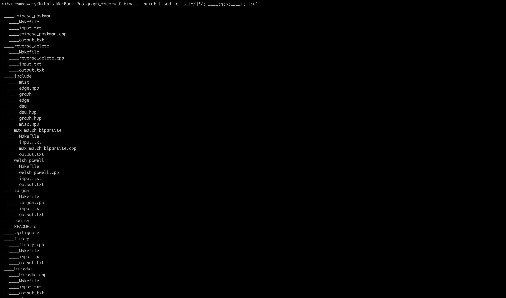

# GTA Assignment 1

```
@author: Nihal Ramaswamy (PES1UG19CS297)
```

## Directory
There are a total of seven algorithms implemented: <br>
1.  [boruvka](./boruvka) <br>
2.  [chinese postman](./chinese_postman) <br>
3.  [fleury](./fleury) <br>
4.  [maximum matching bipartite](./max_match_bipartite) <br>
5.  [reverse delete](./reverse_delete) <br>
6.  [tarjan](./tarjan) <br>
7.  [welsh_powell](./welsh_powell) <br>
<!-- -->
The above said algorithms are placed in their dedicated folders. <br>
The [include](./include) folder contains the implementation of the following <br>
1.  [Disjoint Set Union](./include/dsu.hpp) <br>
2.  [Edge Class](./include/edge.hpp) <br>
3.  [Graph Class](./include/graph.hpp) <br>
4.  [Miscellaneous](./include/misc.hpp) <br>
The above algorithms inherits the `Graph` class and implements functions necessary for it. <br>


## Directory Structure


## Running the Project
There are two ways of running this project. <br>

### Method 1:
Run the file using the bash script. <br>
```bash
chmod a+rx run.sh
./run.sh
```
The [run.sh](./run.sh) file goes to each of the folders containing the implemented algorithm and runs the dedicated `Makefile`. <br>

### Method 2:
Individually the `Makefile`s for each of the folders containing the algorithms. <br>
```bash
cd <FOLDER>
make
```
To remove the generated files <br>
```bash
make clean
```

## Inputs and Outputs
Inputs are provided via chaning the the default `stdin` and outputs are provided via chaning the default `stdin`. <br>
When running the `Makefile`, it runs the following: <br>
```bash
./${FILE} < input.txt > output.txt
```
Here the `<` changes the the `stdin` from default to `input.txt` which is present in each of the folder. <br>
The `>` changes the the `stdout` from default to `output.txt` which is present in each of the folder. <br>

### Format of input
The first line of the input file contains two integers `N` and `M`, representing the number of nodes in the graph and the number of edges. <br>
The next `M` lines contains three integers `u`, `v` and `w`, representing a bidirectional edge between nodes `u` and `v` with a weight `w`. <br>

### Format of output
Format of the output is explained in the individual directories for the algorithms. <br>

